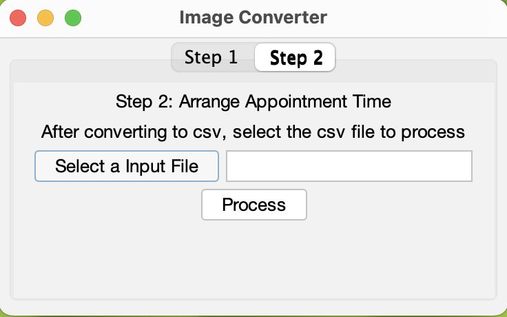

# Image Converter

This is a Java application that converts images to text using [Azure Cognitive Services](
https://azure.microsoft.com/en-us/products/ai-services/ai-vision).

This application assists clinics in converting their paper invoices to formatted text files, aiding them in managing their invoices more efficiently and effectively. Digitize your invoices with Image Converter!

Furthermore, this application helps clinics schedule appointments by analyzing the text from invoices and arranging appointments accordingly.

### Project Collaboration
This project is a collaborative effort conducted by [Cindy Cheng](https://github.com/chengcindyy) and [Melody Yu](https://github.com/Melodieeee), aimed at developing and enhancing the functionality of the Image Converter application.
Feel free to contact us if you have any questions or suggestions!

## Run Image Converter locally
Image Converter is a Java application built using [Maven](https://spring.io/guides/gs/maven/).

### Clone the repository
```bash
git clone https://github.com/Melodieeee/image_converter.git
```

### Prerequisites
Create .env file in the root directory and add the following variables with your [Azure Cognitive Services](
https://azure.microsoft.com/en-us/products/ai-services/ai-vision) subscription key and endpoint.
```
AZURE_TEXT_ANALYTICS_SUBSCRIPTION_KEY=YOUR_AZURE_TEXT_ANALYTICS_SUBSCRIPTION_KEY
AZURE_TEXT_ANALYTICS_ENDPOINT=YOUR_AZURE_TEXT_ANALYTICS_ENDPOINT
```
### After Creating the .env file
You can build a jar file and run it from the command line (it should work just as well with Java 17 or newer):
```bash
cd image_converter
mvn clean package
java -jar target/*.jar
```
You can then see java application pop up and running at your machine.

## Application Instructions
### Step 1 - Convert Images to Text


1. Click on the "Select Input Folder" button to choose a folder containing the images you wish to convert to text. Supported formats include .pdf, .jpeg, .jpg, .png, .gif, .bmp. You can utilize the images and PDFs in the "src/test_files" folder for testing purposes.
2. Click on the "Select a Output File" button to select a file where you want to save the text.
3. Click on the "Convert" button to convert the images to text and wait for the process to finish.
4. You can then view the text in the output file you selected, formatted as shown below:
   

### Step 2 - Schedule Appointments by Different Doctors


1. Choose the CSV file created in the previous step. You can use the "output.csv" file in the "src/test_outputs" folder for testing purposes.
2. Click on the "Process" button to analyze the text and schedule appointments by different practitioners.
3. You can view the appointments in the output files for different practitioners, formatted as illustrated below:

<br> Practitioner 1:

<br> Practitioner 2:


#### Note:
- You can use the images and pdf in the "src/test_files" folder for testing.
- Test output files are available in the "src/test_outputs" folder for reference.
- The test files are for testing purposes only and do not contain any real data.
